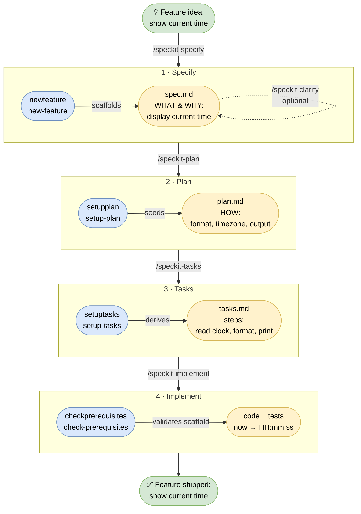

# zspeckit-cli

Zero-dependency Java 25 replacement for the bash helpers in `.specify/scripts/bash/` that spec-kit ships. Four single-file Java 25 launchers backed by one executable JAR, identical CLI contract — `--json` output, exit codes, flags. A companion launcher, `zspecify`, bootstraps a spec-kit project from upstream.

## Commands

Four single-file Java 25 launchers live at the project root, each backed by the JAR:

| Script | Subcommand | Replaces | Purpose |
| --- | --- | --- | --- |
| `newfeature` | `new-feature` | `create-new-feature.sh` | Create a feature branch, scaffold `specs/NNN-slug/`, seed `spec.md` |
| `checkprerequisites` | `check-prerequisites` | `check-prerequisites.sh` | Validate the feature scaffold and report resolved paths |
| `setupplan` | `setup-plan` | `setup-plan.sh` | Seed `plan.md` from the plan template |
| `setuptasks` | `setup-tasks` | `setup-tasks.sh` | Resolve the tasks template and list related docs |

Script filenames carry no dashes — Java source-file mode rejects `-` in a launched file's name — so each maps to its hyphenated subcommand as shown.

## Workflow

A feature moves through four phases — specify, plan, tasks, implement. Each Claude Code slash command (arrow labels) drives one phase, and the zspeckit-cli launchers (blue) scaffold it, producing the artifact (yellow) the next phase consumes. The example carried through is a *show current time* feature.



## Prerequisites

- Java 25+
- [zb](https://github.com/AdamBien/zb) for building

## Build

```
zb
```

Produces `zbo/zspeckit-cli.jar`.

## Install

[`zspeckitinstall`](zspeckitinstall) is a single-file Java 25 script (shebang-launched, no `.java` extension, see the [AIrails.dev](https://airails.dev) `java-cli-script` skill) — no JAR, no build — that downloads the latest release and drops it into a project: the JAR into `<project>/zbo/zspeckit-cli.jar` and the launchers into `<project>/`. The target project is the operand and defaults to the current directory.

Fetch the installer from the [releases page](https://github.com/AdamBien/zspeckit-cli/releases/latest), make it executable, and run it:

```
curl -fLO https://github.com/AdamBien/zspeckit-cli/releases/latest/download/zspeckitinstall
chmod +x zspeckitinstall
```

./zspeckitinstall            # install into the current directory
./zspeckitinstall my-project # install into ./my-project


Each download is atomic — a failed fetch never leaves a half-written file. Run the launchers from the project root, since their shebang resolves `zbo/zspeckit-cli.jar` relative to the working directory.

## Bootstrap a project

`zspecify` scaffolds a spec-kit project from the upstream [spec-kit](https://github.com/github/spec-kit) repo. It needs only Java 25 and network access — no JAR, no build. It fetches the templates and bash helpers into `.specify/` and renders spec-kit's commands into Claude Code skills under `.claude/skills/speckit-*`.

```
./zspecify init my-project
./zspecify init --here              # scaffold the current directory
./zspecify init my-project --ref v0.10.2
```

Flags: `--here` (use the current directory), `--force` (overwrite existing files), `--ref REF` (git ref to fetch, default `main`). Open the result with Claude Code and run `/speckit-constitution`.

## Run

Each launcher puts `zbo/zspeckit-cli.jar` on the classpath via its shebang and calls the boundary class directly — one JVM, no `java -jar` subprocess. Arguments and exit codes pass through unchanged, and no banner is printed, so `--json` output stays clean for agent consumption.

```
./newfeature --json "add user authentication"
./checkprerequisites --paths-only
./setupplan --help
```

The shebang classpath `zbo/zspeckit-cli.jar` is resolved relative to the working directory, so run the scripts from the project root. To call them from anywhere — including inside another spec-kit project — change the shebang to an absolute jar path:

```
#!/usr/bin/env -S java --class-path=/abs/path/to/zspeckit-cli/zbo/zspeckit-cli.jar --source 25
```

Then symlink each onto `PATH`:

```
for s in newfeature checkprerequisites setupplan setuptasks; do
  sudo ln -sf "$PWD/$s" /usr/local/bin/$s
done
```

### Usage

```
new-feature [--json] [--dry-run] [--allow-existing-branch]
            [--short-name <name>] [--number N] [--timestamp]
            <feature description>

check-prerequisites [--json] [--require-tasks] [--include-tasks] [--paths-only]

setup-plan  [--json]
setup-tasks [--json]
```

`--json` switches each subcommand to machine-readable output for agent consumption.

### Run the JAR directly

The launchers are optional — invoke the JAR if you prefer:

```
java -jar zbo/zspeckit-cli.jar <subcommand> [options]
java -jar zbo/zspeckit-cli.jar new-feature --help
```

## Drop-in replacement for `.specify/scripts/bash/`

Spec-kit's slash commands shell out to `.specify/scripts/bash/<name>.sh`. Symlink each `<name>.sh` to the matching launcher above to swap the bash chain for these scripts — Claude Code skills will keep working unchanged.
